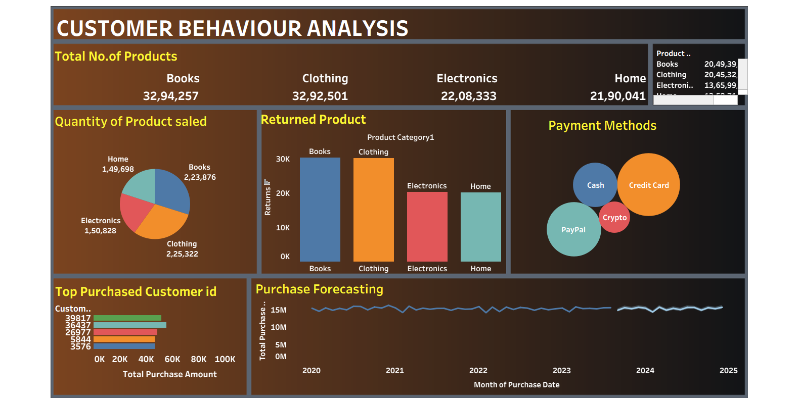

# 📊 Customer Behavior Analysis Dashboard

This project showcases a comprehensive **Customer Behavior Analysis Dashboard** developed using **Tableau** . The dashboard visualizes various aspects of customer purchasing behavior, product performance, and payment patterns over time, aiding in data-driven business decisions.

---

## 🔍 Overview

The dashboard provides insights into:

- Total number of products sold across categories
- Product return patterns
- Popular payment methods
- Top purchasing customers
- Sales forecasting across multiple years

This analysis helps businesses better understand customer preferences, manage inventory, reduce return rates, and enhance overall profitability.

---

## 📊 Key Visualizations

| Visualization                 |                                    Description                                                 |
|-------------------------------|------------------------------------------------------------------------------------------------|
| **Total No. of Products**     | Total items sold in each category (Books, Clothing, Electronics, Home)                         |
| **Quantity of Product Sold**  | Pie chart showing distribution of products sold                                                |
| **Returned Product**          | Bar chart comparing return rates per category                                                  |
| **Payment Methods**           | Bubble chart visualizing the share of payment modes like Cash, Credit Card, PayPal, and Crypto |
| **Top Purchased Customer ID** | Bar chart showing customers with the highest purchase amounts                                  |
| **Purchase Forecasting**      | Time-series forecasting of purchase volume from 2020 to 2025                                   |

---

## 🛠️ Tools Used

- **Tableau**
- **Data Analytics & Forecasting**
- **Data Visualization & Design**
- **Interactive Dashboard Components**

---

## 🖼️ Dashboard Preview

---

